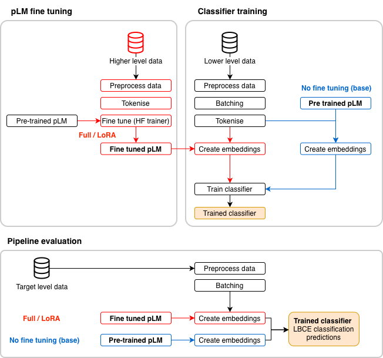

# Phylogeny-Aware Protein Language Model Fine-Tuning for Per-Residue Classification
This repository contains the code and supporting materials developed for Hey LoRA, it's Me: A systematic assessment of the performance gains of baseline/fine-tuned protein language models vs. classic features for the downstream task of epitope prediction.

### Abstract 
B-cell epitopes are antigenic regions recognised by B-cell receptors that are important targets in vaccine and therapeutic development [1,2,3,4]. A class of B-cell epitopes, linear B-cell epitopes (LBCEs) are sequences of amino acids adjacent in an antigen's primary structure that can be computationally predicted as a low-cost alternative for LBCE screening [3,5,6,7]. 

Protein language models (pLM) provide abstract sequence representations that capture protein structure, functionality and evolutionary context that can be adapted to downstream tasks using fine-tuning [8,9,10,11]. Parameter-efficient fine-tuning (PEFT) methods like low-rank adaptation (LoRA), enable task-specific adaptation at lower computational cost than full-fine tuning [12,8].

Previous studies suggest fine-tuning pLMs can improve downstream predictive performance [13], including LBCE predictions for data-scarce pathogens using phylogeny-informed data [7]. This project hypothesised that pLM fine-tuning would improve the performance of per-residue classification predictions with phylogeny-aware datasets, compared with frozen pLMs and domain-specific features. 

This project included the development, training, evaluation and final performance assessment of pLM pipelines for the downstream task of LBCE per-residue classification prediction using phylogeny-aware datasets. Predictions employing engineered Pfeature representations were also assessed. Full fine-tuning produced pathogen specific effects that were directionally inconsistent with fine-tuning mode and model size. Additionally, LoRA PEFT did not improve performance compared with frozen pLM embeddings. Overall the results do not support a consistent benefit from pLM fine-tuning for phylogeny-aware per-residue LBCE classification prediction across the pathogens tested.

### Project Overview
This repository contains pipelines for:
- Preparation and preprocessing of pathogen/epitope datasets.
- Fine-tuning pre-trained protein language models (ESM-2 and ProtT5-XL) using full-fine tuning and LoRA PEFT.
- Training per-residue classifiers using pLM embeddings or Pfeature representations.
- Output of model-performance metrics.
  
The analysis contains:
- Comparison and analysis of fine-tuned and non-fine-tuned models or engineered-feature representations across different pathogen datasets.

### Implementation
Please refer to Thesis.pdf for implementation notes. 

## Pipelines
The pLM pipelines supports three modes: 
- fine-tuning the pretrained language model using full fine-tuning (full)
- fine-tuning using or LoRA (LoRA)
- using the pretrained model directly without fine-tuning (base)

The resulting embeddings are used to train an LBCE classifier and generate predictions on target-level data.

* Overview of pipeline training and evaluation within for classifying embeddings from pre-
trained or fine-tuned pLMs for the purpose of LBCE classification prediction. pLM fine-tuning modes with full fine-tuning or LoRA fine-tuning is shown in red. The base mode using the pre-trained pLM only is shown in blue*

The Pfeature pipeline supports generation of engineered Pfeatures to train an LBCE classifier and generate predictions on target-level data. 

### References
[1] Mike Schutkowski and Ulrich Reineke, editors. Epitope Mapping Protocols, volume 524 of Methods in Molecular Biology™. Humana Press, Totowa, NJ, 2009.
[2] Joakim Nøddeskov Clifford, Eve Richardson, Bjoern Peters, and Morten Nielsen. AbEpiTope-1.0: Improved antibody target prediction by use of AlphaFold and inverse folding. Science Advances, 11(24):eadu1823, June 2025.

[3] Francisca Villanueva-Flores, Javier I. Sanchez-Villamil, and Igor Garcia-Atutxa. AI-driven epitope prediction: a systematic review, comparative analysis, and practical guide for vaccine development. npj Vaccines, 10(1):207, August 2025.

[4] Jodie Ashford, Jo˜ao Reis-Cunha, Igor Lobo, Francisco Lobo, and Felipe Campelo. Organism-specific training improves performance of linear B-cell epitope prediction. Bioinformatics, 37(24):4826–4834, December 2021.

[5] Feng Jiang, Yuzhi Guo, Hehuan Ma, Saiyang Na, Weizhi An, Bing Song, Yi Han, Jean Gao, Tao Wang, and Junzhou Huang. AlphaEpi: Enhancing B Cell Epitope Prediction with AlphaFold 3. In Proceedings of the 15th ACM International Conference on Bioinformatics, Computational Biology and Health Informatics, BCB ’24, pages 1–8, New York, NY, USA, December 2024. Association for Computing Machinery.

[6] Joakim Nøddeskov Clifford, Magnus Haraldson Høie, Sebastian Deleuran, Bjoern Peters, Morten Nielsen, and Paolo Marcatili. BepiPred-3.0: Improved B-cell epitope prediction using protein language models. Protein Science, 31(12):e4497, 2022. eprint: https://onlinelibrary.wiley.com/doi/pdf/10.1002/pro.4497.

[7] Lindeberg Pessoa Leite, Te´ofilo Emidio de Campos, Francisco Pereira Lobo, and Felipe Campelo. Phylogeny-informed transfer learning with protein language models for epitope prediction, March 2026. ISSN: 2692-8205 Pages: 2025.04.17.649425 Section: New Results.

[8] Zeming Lin, Halil Akin, Roshan Rao, Brian Hie, Zhongkai Zhu, Wenting Lu, Nikita Smetanin, Robert Verkuil, Ori Kabeli, Yaniv Shmueli, Allan dos Santos Costa, Maryam Fazel-Zarandi, Tom Sercu, Salvatore Candido, and Alexander Rives. Evolutionary-scale prediction of atomic-level protein structure with a language model. Science, 379(6637):1123–1130, March 2023.

[9] R. Prabakaran and Yana Bromberg. Quantifying uncertainty in protein representations across models and tasks. Nature Methods, 23(4):796–804, April 2026.
[10] Sarah M. Burbach and Bryan Briney. Improving antibody language models with native pairing. Patterns, 5(5), May 2024.

[11] Meng Wang, Jonathan Patsenker, Henry Li, Yuval Kluger, and Steven H. Kleinstein. Supervised fine-tuning of pre-trained antibody language models improves antigen specificity prediction. PLOS Computational Biology, 21(3):e1012153, March 2025.

[12] Edward J. Hu, Yelong Shen, Phillip Wallis, Zeyuan Allen-Zhu, Yuanzhi Li, Shean Wang, Lu Wang, and Weizhu Chen. LoRA: Low-Rank Adaptation of Large Language Models, June 2021.

[13] Robert Schmirler, Michael Heinzinger, and Burkhard Rost. Fine-tuning protein language models boosts predictions across diverse tasks. Nature Communications, 15(1):7407, August 2024.

